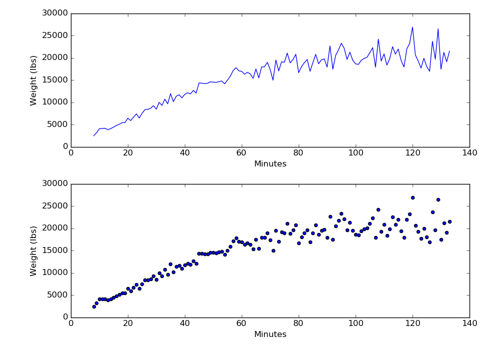
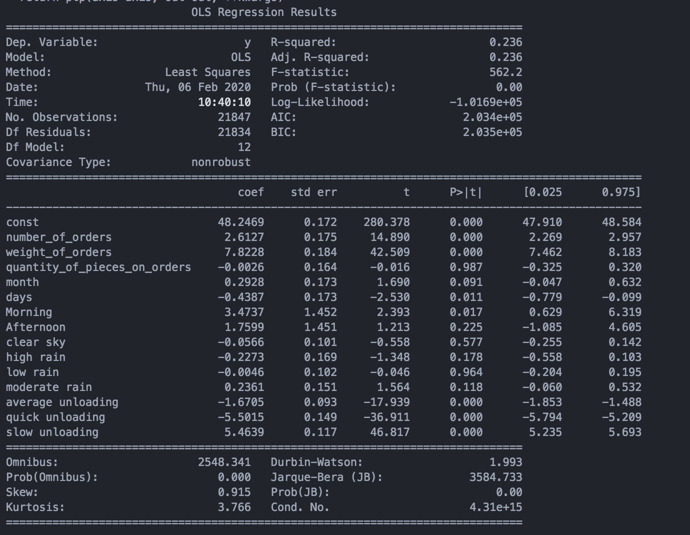
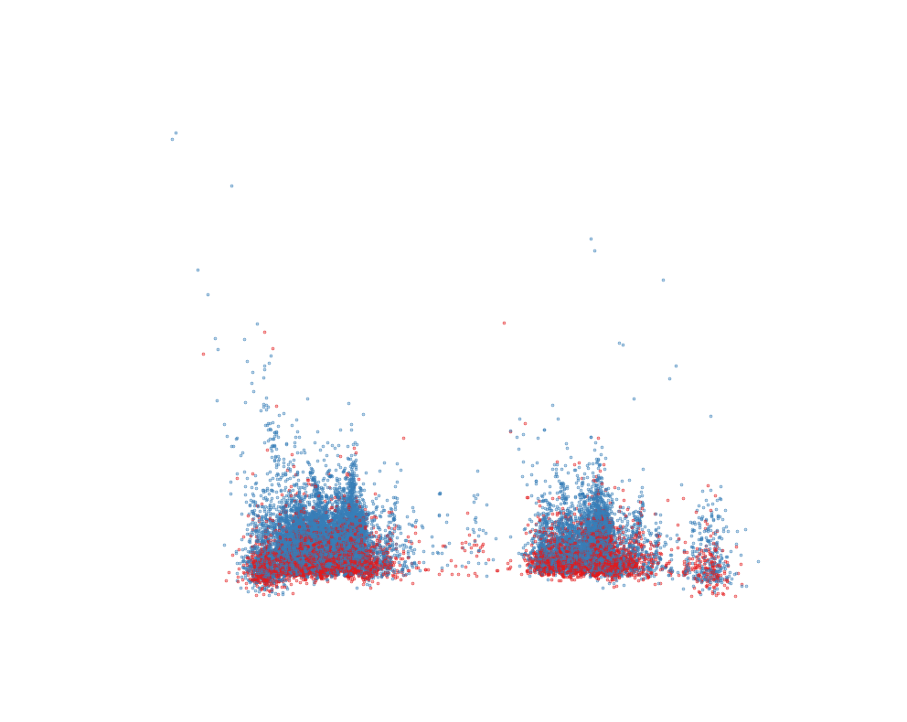
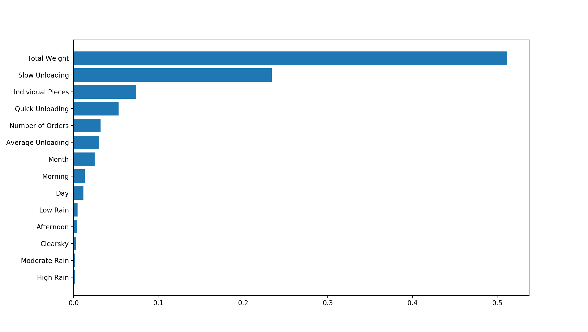
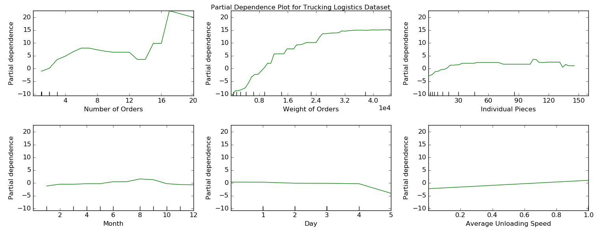

  <h1 align="center">
	Keep On Trucking
  </h1>

 ## Table of Contents
1. [Introduction](#Introduction)
2. [Data](#Data)
3. [EDA](#EDA)
4. [Analysis](#Analysis)
5. [Additional Questions](#Conclusions)

## Introduction

The trucking industry is a key player in the economy for the United States. Most industries that produce good rely on trucking to deliver their products to the consumer. Over the past few years, there has been a decline in truck drivers. As a result trucking rates have increased. One particular way to mitigate the effects of rising Truck prices can be found in providing better trucking logistics.
This cases study revolves around a trucking logistics to determine if a model can be used to predict how long a truck might be at a single location unloading product. If a model can accurately predict how long the unloading duration is, more deliveries can be made in a single day saving this company thousands of dollars.

## Data

Data was obtained from a Transview Logistics. They provide trucking logistic services to several steel company's in Houston Texas. Shipments typically are valued in millions of dollars. Large portions of this data provided inaccurate data. This data was collected from an app provided to the drivers.

| Column Names     | Description   |
| ---------------- | ------------- |
| ADDRESS_ID       | Unique int    |              
| DRIVER_ID        | Unique int    |
| ARRIVAL_TIME     | Timestamp     |
| DEPARTURE_TIME   | Timestamp     |
| TOTAL_WEIGHT     | Integer       |
| NUMBER_OF_PIECES | Integer       |
| BILL_OF_LANDING  | Unique int    |
| WEATHER_PRCP     | Integer       |
| NUMBER_OF_ORDERS | Integer       |

Data issues:

Arrival_time/Departure_time - had many values one minute or less, had many values above 2 hours. Typical stop time should range from 8 minutes to 1.5 hours.

Driver_id - driver ids are recording wrong.

## EDA

The first thing I wanted to look at was the distribution of my stop times. From past knowledge I was informed that many of the stops past 2 hours were invalid. Most of the stop times are distributed around 30 minutes with a right skew.

One big assumption I held was that total weight of each delivery could help in predicting unloading times. Above shows that a trend can be seen. As time get larger the variance also seems to increase. Even after grouping by larger intervals, the variance still became more defined.

## Analysis

The model that I will be using to predict the stop time of each truck had to be continuous. The first two models performed on my data were OLS and LinearRegression.

Important Features:
1. Total weight of materials.
2. Number of orders places.
3. Unloading rates for each facility.

The Linear Regression models performed poorly generating a RMSE of about 28 minutes off on average.

Due to the low performing Linear Regressions, looking at different models to detect signal seemed appropriate. My next step was to see if the features in this dataset had some sort of clusters. Checking PCA for with two principal components seemed like a good way to check the signal in my data.

The above PCA plot with two principal components show little difference in the clusters between high and low stop times. When examining the principal components vs explained variance plot, almost all my PC's were required to explain 90% variance.

Heading down further, looking into supervised learning using a RandomForest seemed appropriate for finding some sort of signal within my data.

| Model                 | RMSE-train    | RMSE-test   |
| ----------------      | ------------- | ----------- |
| LinearRegression      | 28.32         | 28.71       |
| RandomForestRegressor | 24.85         | 25.35       |
| GradientBoosting      | 22.48         | 25.22       |

## Conclusions

Being able to predict the unloading time for each truck is important for optimizing route times. Accounting for truck times can help companies predict costs much more efficiently. It also provides Tansview Logistics with a more accurate user interface depicting where each truck currently is.
