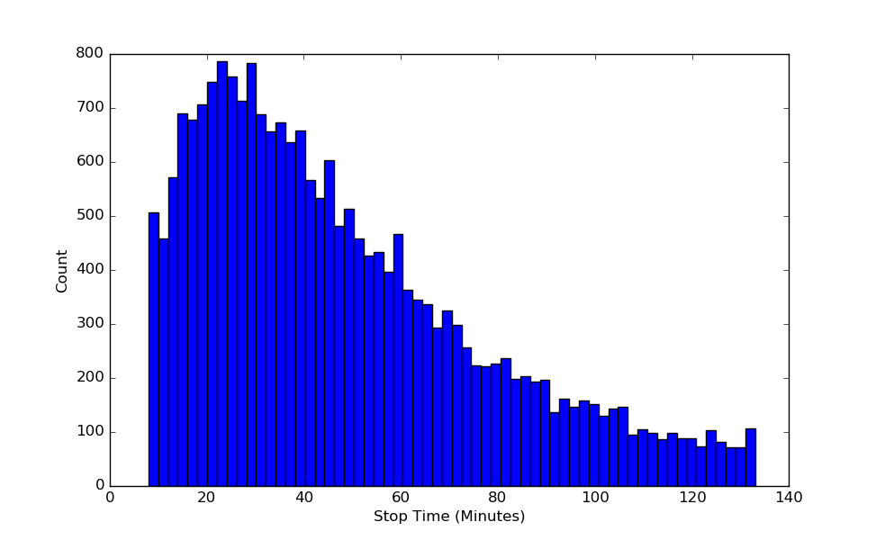

  <h1 align="center">
	Keep on trucking 
  </h1>
  
 ## Table of Contents
1. [Introduction](#Introduction)
2. [Data](#Data)
3. [EDA](#EDA)
4. [Analysis?](#Analysis)
5. [Additional Questions](#Conclusions)

## Introduction

The trucking industry is a key player in the economy for the United States. Most industries that produce good rely on trucking to deliver their products to the consumer. Over the past few years, there has been a decline in truck drivers. As a result trucking rates have increased. One particular way to mitigate the effects of rising Truck prices can be found in providing better trucking logisitcs. 
This cases study will revlove around a houston steel company to determine if a model can be used to predict how long a truck might be at a single location unloading product. If a model can accurately predict how long the unloading duration is, more deliveries can be made in a single day saving this company thousands of dollars.

## Data

Data was obtained from a Transview logistics. They provide trucking logisitic services to several steel companys in Houston Texas. Shipments typically are valued in millions of dollars. Large portions of this data provided inaccurate data. This data was collected from an app provided to the drivers.

| Column Names     | Description   |
| ---------------- | ------------- | 
| ADDRESS_ID       | Unique int    |              
| DRIVER_ID        | Unique int    |
| ARRIVAL_TIME     | Timestamp     | 
| DEPARTURE_TIME   | Timestamp     |
| TOTAL_WEIGHT     | Integer       |
| NUMBER_OF_PIECES | Integer       |
| BILL_OF_LANDING  | Unique int    |
| WEATHER_PRCP     | Integer       |
| NUMBER_OF_ORDERS | Integer       |

Data issues:

Arrival_time/Departure_time - had many values one minute or less, had many values above 2 hours. Typical stop time should range from 8 minutes to 1.5 hours.

Driver_id - driver ids are recording wrong.

## EDA

## Analysis

## Conclusions 
